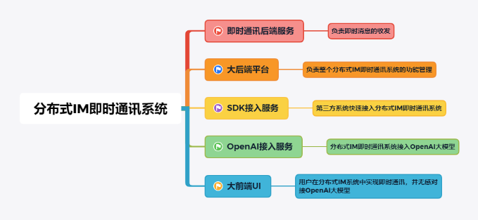
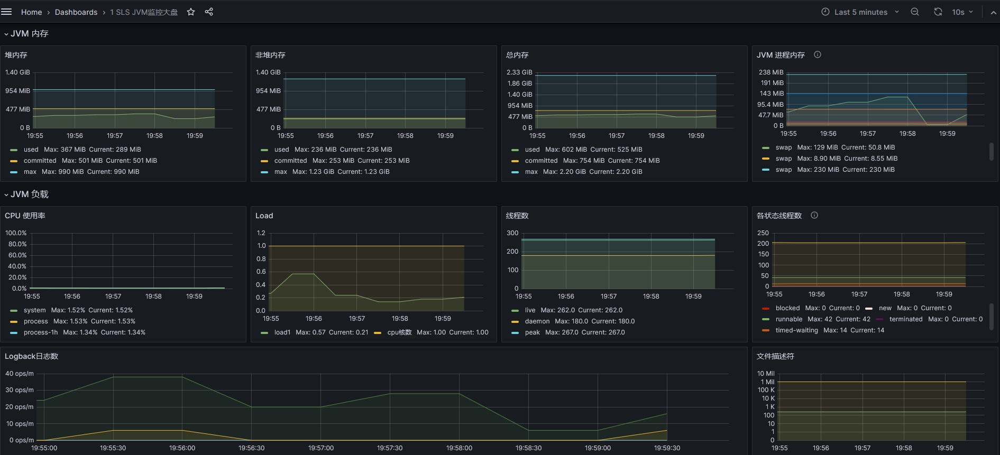

<h1 align="center" style="margin: 30px 0 30px; font-weight: bold;">Prism IM v1.0 GA</h1>
<h3 align="center" style="margin: 30px 0 30px; font-weight: bold;">@author anliwen</h3>
<h4 align="center">基于Netty + ChatGPT的生产级分布式IM系统</h4>

	
	

### 系统简介
本项目是一个基于前端 + 后端 + Devops的分布式即时通讯系统，基于Vue + SpringBoot + Netty + 多种分布式
技术栈 + OpenResty + Swarm + Portainer + Grafana + Prometheus + Docker等，集需求、架构设计、开发、
部署、 上线、运维与监控于一体的分布式IM即时通讯系统
  

  
  

### 构建目标
* 实时通讯
* 多端同步
* 弹性扩展
* 稳定性
* 高可用与容错
* 数据安全与隐私保护
* 数据可靠存储
* 方便集成与扩展
* 其它具体需求与目标

### 应对挑战
* 高并发读
* 高并发写
* 分布式架构
* 多分层架构
* 分布式存储
* 消息缓存
* 实时推送

### 功能盘点

| 聊天相关 | 文件相关 | 群相关   | 好友相关 | OpenAI  | SDK   |
|------|------|-------|------|---------|-------|
| 单聊   | 图片   | 创建群   | 添加好友 | ChatGPT | 开放SDK |
| 群聊   | 文件   | 加/退群  | 删除好友 |         |       |
| 历史消息 | 语音   | 修改群备注 | 查找朋友 |         |       |
| 消息已读 | 视频   | 查看群成员 | 好友拉黑 |         |       |
| 消息未读 | 视频   | 群公告   | 好友置顶 |         |       |

### 技术前沿
#### 前端
* 基于Vue3.0开发完整的分布式IM前端页面，实现各项功能开发
* 跨域请求接口的实现方式与开发技巧
* 基于WebSocket实现即时通讯的方案和落地实现，并实现断线重连、心跳机制
* Git的使用
#### 后端
* 基于DDD领域驱动设计开发项目，使用DDD快速搭建后端服务
* SpringBoot、Mybatis、Mybatis-Plus等开发框架的使用，基于源码深度的理解，基于源码二次开发
* Netty、WebSocket与TCP网络编程，掌握Netty的内存模型、IO多路复用、ChannelPipeline等
* 设计模式
* 分布式技术栈，包括但不限于SpringCloud、SpringCloud Alibaba、Dubbo、Nacos、RocketMQ、
ShardingSphere、Elasticsearch、Logstash、Kibana等
* 真实场景需求转化架构设计方法论、架构设计原则、系统边界划分与维护
* 单元测试
* JMeter压力测试
* CI/CD持续交付高质量代码
* 合理打印日志，实现日志可视化治理的方案，实现分布式系统下的链路追踪方案
* Docker + K8s
* 落地OpenResty的配置与运维，基于OpenResty配置长连接转发、配置SSL与WSS协议等
#### 运维
* Grafana、Prometheus进行监控
* JVM、服务器内存、磁盘、IO、DB、中间件、应用服务(QPS、TPS、TTL等)的完整链路监控